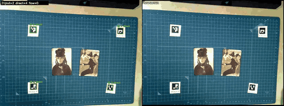

# marker-plane-lock

ArUcoマーカーを使い、ノートや作業面のカメラブレを軽減する動画補正ツールです。

## Demo



[▶ 高画質の比較動画を再生](docs/comparison.mp4)

## Prerequisites

- CMake 3.16 以降
- C++17対応コンパイラ
- OpenCV（`aruco`, `calib3d`, `core`, `imgproc`, `video`, `videoio`）

Ubuntuでは、以下で開発パッケージを導入できます。

```bash
sudo apt install build-essential cmake libopencv-dev
```

## Build

```bash
cmake -S . -B build
cmake --build build
```

`DICT_4X4_50` のID 0-3をノートの四隅に貼り、ノート面そのものを固定する独立した
オフライン版は次の形式で実行します。複数マーカーの中心から安定したSimilarity変換を
推定し、1枚しか見えない場合は四隅を利用します。検出不能区間は前後から補間し、画面全体で
0.4px未満の推定変動は固定して、静止時に補正処理自身が揺れを作らないようにします。
モーションブラーなどでArUco検出が短時間だけ途切れた場合は、直前に検出した四隅をOptical
Flowで最大8フレーム追跡します。前後追跡誤差や四角形の形状が不正な追跡結果は採用しません。

## Usage

```bash
./build/video_marker_offline input.mp4 output.mp4
```

`--step N` を付けると、ArUcoの検出をNフレームごとに行います。中間フレームでは
Optical Flowで四隅を追跡します。既定値は `1` です。

```bash
./build/video_marker_offline input.mp4 output.mp4 --step 4
```

マーカー検出を確認するデバッグ動画も同時に出力できます。直接検出は緑、Optical Flowで
補完したマーカーは橙で表示します。

```bash
./build/video_marker_offline input.mp4 output.mp4 \
    --debug-markers marker_debug.mp4
```

元動画と補正動画を左右に並べた比較動画は、次のスクリプトで作成できます。解像度差は
拡大せず、中央寄せの黒い余白で自動的に揃えます。音声は元動画からコピーします。

```bash
./tools/make_comparison.sh input.mp4 stabilized.mp4 comparison.mp4
```

左右のラベルも指定できます。

```bash
./tools/make_comparison.sh input.mp4 stabilized.mp4 comparison.mp4 \
    "Input" "Stable marker lock"
```
